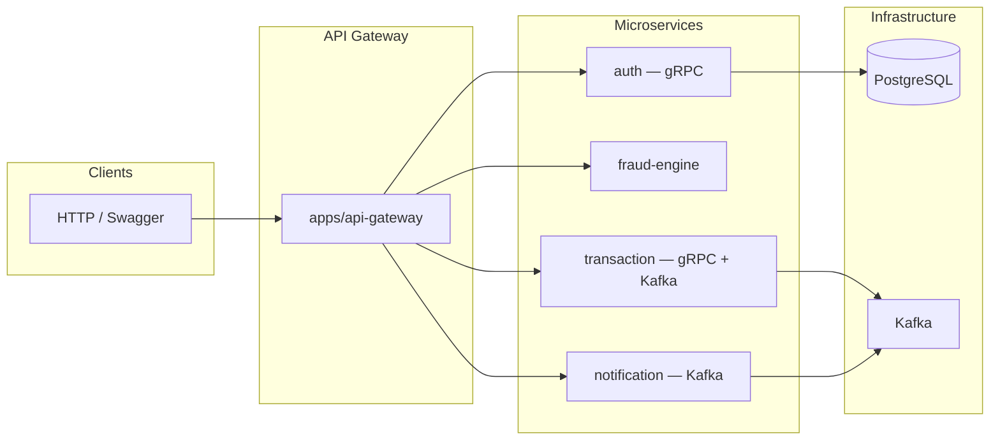

# Backend

**NestJS** monorepo: an HTTP API gateway, **gRPC** microservices, **Kafka** event flow, and shared libraries.

[NestJS](https://nestjs.com/)
[TypeScript](https://www.typescriptlang.org/)
[Node](https://nodejs.org/)


---

## Overview

This repository uses a **Nest monorepo**: business logic lives in applications (`apps/`) and reusable modules (`libs/`). The API gateway exposes HTTP to clients; authentication and other services communicate over gRPC or Kafka.




---

## Applications and libraries


| Application      | Role                                       |
| ---------------- | ------------------------------------------ |
| **api-gateway**  | Unified HTTP API; gRPC clients (e.g. auth) |
| **auth**         | gRPC identity / user service               |
| **fraud-engine** | Fraud detection service                    |
| **notification** | Kafka consumer; outbound email, etc.       |
| **transaction**  | gRPC + Kafka producer                      |


| Library                             | Contents                                               |
| ----------------------------------- | ------------------------------------------------------ |
| `common`                            | Shared configuration, validation, DTOs                 |
| `grpc`                              | Proto definitions and generated client types           |
| `kafka`                             | Broker options, topic constants, offset commit helpers |
| `jwt`, `prisma`, `redis`, `mailgun` | Domain-specific modules                                |


---

## Requirements

- **Node.js** 18+
- **npm**
- **Docker** (optional for local Postgres + Kafka + Kafdrop)

---

## Setup

```bash
npm install
cp .env.example .env
```

Edit `.env` for your environment. If you use Prisma:

```bash
npx prisma generate
```

---

## Environment variables

Keys match `.env.example`. Summary:


| Variable                                         | Description                                           |
| ------------------------------------------------ | ----------------------------------------------------- |
| `DATABASE_URL`                                   | PostgreSQL connection string                          |
| `JWT_SECRET`, `JWT_EXPIRES_IN`                   | JWT settings                                          |
| `AUTH_SERVICE_URL` … `TRANSACTION_SERVICE_URL`   | gRPC client addresses (gateway)                       |
| `AUTH_SERVICE_PORT` … `TRANSACTION_SERVICE_PORT` | Listen port per service                               |
| `KAFKA_BROKER`                                   | Broker list; comma-separated (`host:port,host2:port`) |
| `MAILGUN_*`                                      | Transactional email (Mailgun)                         |


**Kafka in Docker:** the `backend` service in `docker-compose` uses `KAFKA_BROKER=kafka:29092`. When your app runs on the **host** against the bundled Kafka container, use `localhost:9092` (the `PLAINTEXT_HOST` listener).

---

## Development

Run a single app in watch mode:

```bash
npx nest start api-gateway --watch
npx nest start auth --watch
npx nest start notification --watch
npx nest start transaction --watch
npx nest start fraud-engine --watch
```

Build everything:

```bash
npm run build
```

Production entrypoint (default gateway):

```bash
npm run start:prod
```

Formatting and lint:

```bash
npm run format
npm run lint
```

---

## gRPC and protos

Proto files live under `libs/grpc/proto/`. Regenerate TypeScript:

```bash
npm run proto:build
```

> On Windows, `package.json` references `protoc-gen-ts_proto.cmd`. On macOS/Linux, ensure `protoc` and the plugin are on your `PATH`, or adjust the command for your platform.

---

## Docker

Infrastructure plus the sample `backend` service:

```bash
docker compose up -d
```


| Service                | Port   | Notes                         |
| ---------------------- | ------ | ----------------------------- |
| **backend**            | `3000` | Image built from `Dockerfile` |
| **backend-db**         | `5432` | PostgreSQL 16                 |
| **kafka**              | `9092` | Access from the host          |
| **zookeeper**          | `2181` | Kafka dependency              |
| **kafka-ui** (Kafdrop) | `9000` | Topics / message inspection   |


---

## Tests

```bash
npm run test
npm run test:cov
```

---

## License

This project is **UNLICENSED** (private use), consistent with `package.json`.